<div align="center">



<br><br>

[](https://github.com/mario-zahariev/NOCTO/actions/workflows/ci.yml)
[](https://developer.apple.com/ios/)
[](https://www.swift.org)
[](https://developer.apple.com/xcode/)
[](https://developer.apple.com/xcode/swiftui/)
[](#capabilities)
[](LICENSE)
[](https://github.com/mario-zahariev/NOCTO/commits/main)

</div>

---

NOCTO is a local-first nightlife guide for Sofia: fast venue discovery, clear Night Pulse signal, and zero tracker noise.

<details>
<summary><strong>Technical depth (for contributors)</strong></summary>

Venue records flow from `venues.json` through `NOCTOCore`'s typed decode-and-validate pipeline before any view receives data. Invalid entries are rejected at the repository boundary, not silently ignored. Firebase is deliberately absent; it re-enters only through a defined remote adapter contract, not as passive dependency weight.

</details>

---

## What is NOCTO?

NOCTO is a local-first iOS nightlife app for Sofia. It helps users quickly find relevant venues, track computed local operational signal quality through Night Pulse, and keep favorites persisted on-device.

For users:
- Discover venues across Home, Map, Favorites, and Night Pulse.
- Save personal favorites with local persistence (`UserDefaults`).
- Use proximity-aware ranking with `authorizedWhenInUse` location access.

For contributors:
- `NOCTOCore` enforces typed venue decoding and validation boundaries.
- UI layers consume validated data only; failures remain explicit and typed.

---

## Data Flow

```text
ContentView
  └── VenueRepository
        └── VenueDataSource                ← protocol boundary
              └── LocalVenueDataSource
                    └── LocalVenueRepository  (NOCTOCore)
                          └── VenueRepositoryCore → [Venue]  ← filter(\.isValid) applied
                                          ↑
                                    venues.json  (bundle resource)

FavoritesManager      @MainActor · @Published UUID set · UserDefaults persistence
OperationalSnapshot   pulse index · type mix · latency band · signal confidence
LocationManager       CLLocationManager · authorizedWhenInUse · 100m accuracy
```

Every layer fails loudly with typed errors. No degraded state reaches a view.

---

## Capabilities

| Surface | Implementation |
|---|---|
| **Home** | `HomeView` — `HeroParallaxCard` + curated `VenueCard` list |
| **Map** | `AllVenuesMapView` — MapKit annotations, `NoctoTheme.accent` pins |
| **Favorites** | `FavoritesView` — filtered by `FavoritesManager.isFavorite(_:)` |
| **Night Pulse** | `NightPulseView` — `OperationalSnapshot` signals: pulse index, type mix, latency, completeness |
| **Profile** | `ProfileView` — Night Pass surface; Admin behind `#if DEBUG` only |

### Night Pulse Signals

- **Pulse index** — composite activity score for the active venue dataset.
- **Type mix** — distribution across venue categories (`club`, `bar`, `lounge`, `event`, `other`).
- **Latency band** — freshness band for the current signal window.
- **Completeness** — share of venue records that passed validation and are renderable.

---

## Requirements

| | Version |
|---|---|
| iOS deployment target | 17.0 |
| macOS (test target) | 14.0 |
| Xcode | 26.1+ (Swift 5 language mode supported) |
| Swift tools | 5.10 (package tools baseline) |
| Bundle identifier | `com.mario.NOCTO` |

---

## Project Structure

```text
NOCTO/
├── NOCTOApp.swift              @main · WindowGroup entry point
├── ContentView.swift           Root composition — async venue load, owns FavoritesManager
├── HomeView.swift              HeroParallaxCard + venue list, NavigationStack
├── VenueDetailView.swift       MapKit single-venue map, address, working hours
├── AllVenuesMapView.swift      Full-map MKCoordinateRegion, all venue annotations
├── FavoritesView.swift         Filtered venue list, ContentUnavailableView on empty
├── NightPulseView.swift        OperationalSnapshot cards — hero, signals, type mix, quality
├── ProfileView.swift           Night Pass identity + metrics; Admin link (#if DEBUG)
├── AdminDashboardView.swift    Dev-only operational stat list — counts, health, latency
│
├── VenueCard.swift             Type label · name · address · hours · favorite toggle
├── HeroParallaxCard.swift      ParallaxCard + accent gradient overlay, 180pt height
├── ParallaxCard.swift          3D rotation via PreferenceKey scroll position tracking
├── BlurView.swift              UIVisualEffectView bridge — .systemUltraThinMaterialDark
├── MicroFeedback.swift         ViewModifier — scaleEffect(0.98), .easeOut(0.12s) on press
│
├── FavoritesManager.swift      @MainActor ObservableObject — UUID set + UserDefaults
├── LocationManager.swift       CLLocationManagerDelegate — authorizedWhenInUse
├── OperationalSnapshot.swift   Computed: trafficIndex · typeSignals · latencyBandLabel
├── VenueRepository.swift       Composes any VenueDataSource
├── VenueDataSource.swift       Protocol + LocalVenueDataSource concrete adapter
├── Venue.swift                 typealias Venue = NOCTOCore.Venue
│
├── NoctoTheme.swift            Design tokens: background #050609 · accent #FD5B8A
├── Color+Hex.swift             Color(hex:) — Scanner, sRGB, 6-digit only
└── Haptics.swift               UIImpactFeedbackGenerator(.light) · .notificationOccurred(.success)

Sources/NOCTOCore/
├── VenueCore.swift             Venue model — Codable · Identifiable · CLLocationCoordinate2D
│                               isValid: non-empty name + coordinate bounds
├── VenueRepositoryCore.swift   JSONDecoder → filter(\.isValid) — throws .invalidJSON / .noValidVenues
└── LocalVenueRepository.swift  Bundle resource lookup → Data → VenueRepositoryCore

Tests/NOCTOCoreTests/
└── VenueRepositoryCoreTests    valid payload · invalid JSON · all-invalid venue entries

scripts/
├── validate_venues_json.py     9 required fields · UUID · coordinate range · ≥10 entries
└── ci/check_firebase_detached.sh  Guards Firebase detachment and example plist placeholder values
```

---

## Quick Start

NOCTO is currently source-first in this repository. Public TestFlight or App Store distribution is not declared here yet.

```zsh
git clone https://github.com/mario-zahariev/NOCTO.git
open NOCTO.xcodeproj
# Select NOCTO scheme → run on iOS 17+ simulator or device
```

**Load venues from the app bundle:**

```swift
import NOCTOCore

let venues = try LocalVenueRepository().loadVenues()
// [Venue] — decoded, validated, invalid entries removed
```

**Decode from raw Data:**

```swift
import NOCTOCore

let venues = try VenueRepositoryCore().decode(from: data)
// throws .invalidJSON or .noValidVenues — never silently degrades
```

---

## NOCTOCore Package

Referenced as a local Swift package via the `.` relative path in `NOCTO.xcodeproj`. Once semantic version tags are published:

```swift
.package(
    url: "https://github.com/mario-zahariev/NOCTO.git",
    from: "1.0.0"
)
```

Add `NOCTOCore` to target dependencies. Use `main` as a temporary fallback only. Do not pin to commit SHAs in shared documentation.

---

## Data Contract

Every record in `venues.json` must satisfy `scripts/validate_venues_json.py` and `VenueCore.isValid` at decode time.

```json
{
  "id":           "A8E1F9E4-3C2A-4F3E-9B7D-123456789ABC",
  "name":         "Bedroom Premium",
  "imageName":    "bedroom",
  "type":         "club",
  "description":  "Премиум клубно преживяване с фокус върху house и melodic nights.",
  "latitude":     42.6977,
  "longitude":    23.3219,
  "address":      "бул. Витоша 12, София",
  "workingHours": "22:00-06:00"
}
```

All nine fields are required. `imageName` and `description` are validated as non-empty strings. `VenueCore.isValid` re-enforces non-empty `name` and coordinate bounds at runtime. The Python validator additionally requires a minimum of 10 entries in the dataset.

**Venue types:** `club` · `bar` · `lounge` · `event` · `other`

---

## CI Pipeline

Four gates run on every push to `main` and every pull request. All four must pass.

```zsh
# 1. Firebase detachment guard
bash scripts/ci/check_firebase_detached.sh

# 2. Venue schema validation
python3 scripts/validate_venues_json.py

# 3. NOCTOCore unit tests
swift test

# 4. App smoke build
xcodebuild -project NOCTO.xcodeproj \
           -scheme NOCTO \
           -sdk iphonesimulator \
           -destination 'generic/platform=iOS Simulator' \
           build
```

Dependabot keeps GitHub Actions runners and the Swift package graph current on a weekly cadence.

### Documentation and Coverage Artifacts

The `Docs and Coverage` workflow generates review artifacts when package sources,
tests, `Package.swift`, or the workflow itself change:

- Swift package coverage JSON
- `NOCTOCore` DocC archive

It can also be started manually from GitHub Actions when documentation or
coverage evidence is needed outside a pull request.

---

## Linting

SwiftLint runs against `NOCTO/` and `Sources/`. Key configuration in `.swiftlint.yml`:

- `force_cast` → **error**
- `force_try` → **error**
- `force_unwrapping` → opt-in, flagged
- Line length: warning at 140, error at 180
- `todo` disabled — tracked in roadmap instead

---

## Firebase

Fully detached at every level.

```
no FirebaseApp.configure()
no firebase-ios-sdk package reference in project.pbxproj
no FirebaseAnalytics or FirebaseFirestore target linkage
no GoogleService-Info.plist in target Build Resources
NOCTO/GoogleService-Info.plist remains ignored and local-only
NOCTO/GoogleService-Info.plist.example remains the tracked placeholder fixture
```

`scripts/ci/check_firebase_detached.sh` scans `NOCTO.xcodeproj/project.pbxproj` for Firebase linkage markers and fails the build if any are found, if `GoogleService-Info.plist` is re-added to Build Resources, if the real `NOCTO/GoogleService-Info.plist` becomes tracked by git, or if `NOCTO/GoogleService-Info.plist.example` is missing or no longer contains the expected placeholder values.

Firebase re-enters only when a remote `VenueDataSource` adapter exists — with a defined contract, security rules, health metrics, and a fallback strategy. Not before.

```zsh
# Create a local Firebase config only when intentionally testing Firebase locally
cp NOCTO/GoogleService-Info.plist.example NOCTO/GoogleService-Info.plist
```

---

## Roadmap

| Area | Status | Next |
|---|---|---|
| Local venue intelligence | ✦ Active | Expand `OperationalSnapshot` Night Pulse signals |
| Profile · Night Pass | ✦ Active | Real user state and preference persistence |
| Admin | ✦ Done (Dev-only) | Keep `#if DEBUG` gate in `ProfileView`; keep it out of consumer navigation |
| Remote backend | ◯ Planned | Define `VenueDataSource` remote adapter contract first |
| UI coverage | ◯ Planned | Snapshot and smoke tests for key surfaces |

---

<div align="center">

[Contributing](CONTRIBUTING.md) &nbsp;·&nbsp; [Code of Conduct](CODE_OF_CONDUCT.md) &nbsp;·&nbsp; [Security](SECURITY.md) &nbsp;·&nbsp; [License](LICENSE) &nbsp;·&nbsp; [Architecture](docs/ARCHITECTURE.md) &nbsp;·&nbsp; [Product Bible](docs/PRODUCT_BIBLE.md)

<br>

<sub>NOCTO — signal over noise.</sub>

<br><br>

</div>
