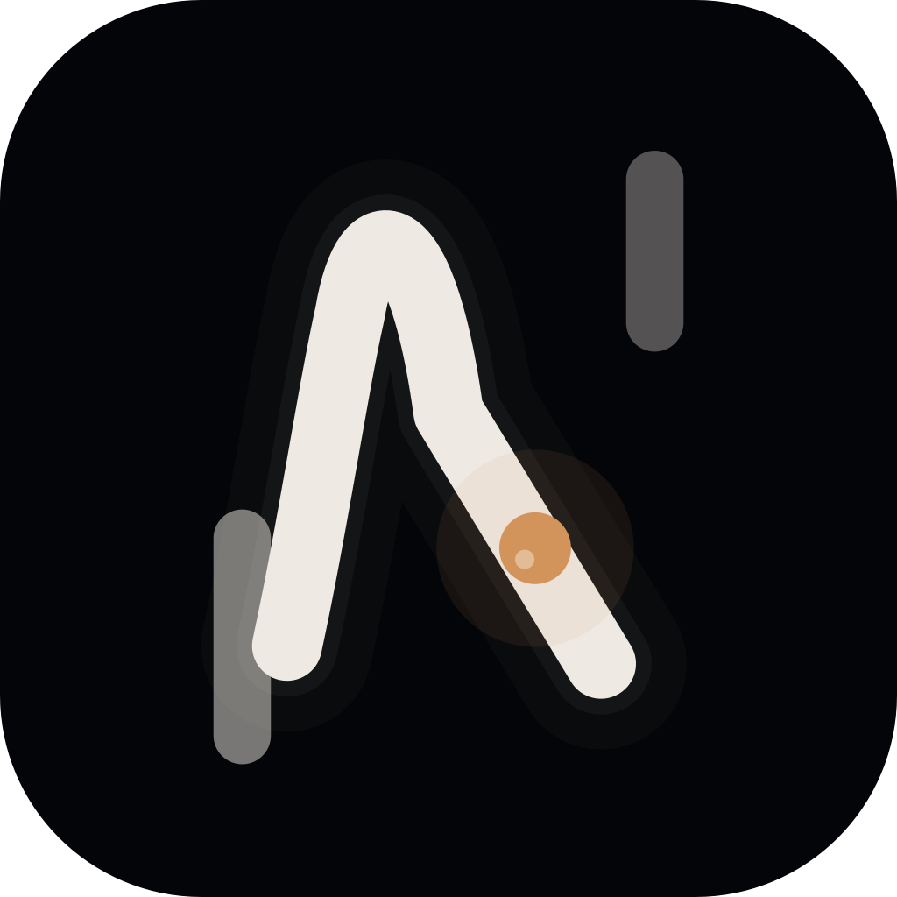

# NOCTO

_Premium local-first nightlife intelligence for Sofia._

[](https://github.com/mariozahariev69-design/NOCTO/actions/workflows/ci.yml)
[](https://swift.org)
[](https://developer.apple.com)
[](LICENSE)

<p align="center">
  
</p>

NOCTO is an iOS-first app for curated Sofia venue discovery, local nightlife signals, favorites, and map-based exploration. The current architecture is intentionally local-first: venue data is loaded from validated JSON through `NOCTOCore`, with Firebase detached until there is a real remote data path worth adding.

## Current Scope

- **Venue discovery** - curated venue cards with address, working hours, type, and detail views.
- **Favorites** - local `UserDefaults` persistence through `FavoritesManager`.
- **Map** - MapKit venue annotations and location-focused exploration.
- **Night Pulse** - computed local signals from the active venue dataset.
- **Profile / Night Pass surface** - public profile entry point, with admin tooling kept dev-only.
- **Local data validation** - `venues.json` schema checks and package-level decoding tests.

## Requirements

- iOS 17.0+ for the app target
- macOS 14+ for the Swift package test target
- Xcode 26.1+ or newer for the checked-in Xcode project format
- Swift tools 5.10+ for the `NOCTOCore` package manifest

## Tech Stack

- SwiftUI
- MapKit
- Swift Package Manager
- `NOCTOCore` for reusable venue decoding and validation
- Local JSON data source
- GitHub Actions CI for package tests, app smoke build, schema validation, and Firebase detachment guard

## Project Structure

```text
NOCTO/
  iOS app target: views, app entry, repositories, managers, theme/helpers

Sources/NOCTOCore/
  Swift package core module for reusable venue decoding and validation

Tests/NOCTOCoreTests/
  Unit tests for valid JSON, invalid JSON, and all-invalid venue payloads

scripts/
  Local/CI validation helpers
```

## Run The App

1. Clone the repository.
2. Open `NOCTO.xcodeproj` in Xcode.
3. Select the `NOCTO` scheme.
4. Run on an iOS 17+ simulator or device.

Firebase remains detached by default. If Firebase is intentionally re-enabled later, copy `NOCTO/GoogleService-Info.plist.example` to a local-only `NOCTO/GoogleService-Info.plist`. Do not commit real Firebase credentials.

## Swift Package Usage

`NOCTOCore` can be consumed through Swift Package Manager. Once release tags are published, prefer semantic version requirements:

```swift
.package(
    url: "https://github.com/mariozahariev69-design/NOCTO.git",
    from: "1.0.0"
)
```

Until the first semantic version tag exists, `main` can be used as a temporary development fallback. Do not use commit revisions in public setup docs unless there is an exceptional internal reason.

Then add `NOCTOCore` to your target dependencies.

## Quick Start

Load validated venues from a bundled `venues.json`:

```swift
import NOCTOCore

let repository = LocalVenueRepository()
let venues = try repository.loadVenues()

print("Loaded \(venues.count) venues")
```

Decode venue data directly when you already have `Data`:

```swift
import NOCTOCore

let decoder = VenueRepositoryCore()
let venues = try decoder.decode(from: data)
```

## Data Contract

Venue data is loaded from `venues.json` and validated before rendering.

Required fields:

```json
{
  "id": "D4A55276-0F5D-4C5B-A74B-8B0D2E2159AA",
  "name": "EXE Club",
  "imageName": "exe-club",
  "type": "club",
  "description": "High-energy club in central Sofia.",
  "latitude": 42.6977,
  "longitude": 23.3219,
  "address": "Sofia, Bulgaria",
  "workingHours": "23:00 - 06:00"
}
```

Supported venue types:

- `club`
- `bar`
- `lounge`
- `event`
- `other`

The tracked repository dataset requires `imageName` and `description` because the local schema validator enforces them before CI passes.

## Quality Controls

- `python3 scripts/validate_venues_json.py`
- `bash scripts/ci/check_firebase_detached.sh`
- `swift test`
- iOS simulator smoke build through GitHub Actions
- Dependabot metadata for GitHub Actions maintenance

## Firebase Posture

Firebase is currently detached:

- no Firebase runtime initialization
- no Firebase target linkage
- no tracked production `GoogleService-Info.plist`
- CI guard prevents accidental Firebase relinkage

Firebase should only return through a deliberate remote data adapter, not as passive dependency weight.

## Roadmap

| Area | Status | Next Move |
| --- | --- | --- |
| Local venue intelligence | Active | Expand computed Night Pulse signals |
| Profile / Night Pass | Active | Add real user-facing state and preferences |
| Admin operations | Dev-only | Keep operational checks out of public navigation |
| Remote backend | Planned | Define adapter contract before choosing provider |
| UI validation | Planned | Add focused screenshot/smoke coverage |

## Repository Links

- [Contributing](CONTRIBUTING.md)
- [Security Policy](SECURITY.md)
- [License](LICENSE)
- [Product Bible](docs/NOCTO_BRAND_PRODUCT_BIBLE_v1.md)
